<p align="center">
  <h1 align="center">🖋️ Ink-Graph</h1>
  <p align="center">
    <em>AI Agent Skill · Natural Language → Animated SVG Technical Diagrams</em>
  </p>
</p>

<p align="center">
  <a href="LICENSE"></a>
  <a href="https://www.npmjs.com/package/ink-graph"></a>
  <a href="https://www.npmjs.com/package/ink-graph"></a>
  <a href="https://github.com/qaz1230sp/ink-graph/stargazers"></a>
  <a href="CONTRIBUTING.md"></a>
  <a href="https://github.com/qaz1230sp/ink-graph/issues"></a>
</p>

<p align="center">
  <a href="https://www.npmjs.com/package/ink-graph"><b>📦 npm Package</b></a> &nbsp;|&nbsp;
  <a href="SKILL.md"><b>📄 SKILL.md</b></a> &nbsp;|&nbsp;
  <a href="CONTRIBUTING.md">🤝 Contribute</a> &nbsp;|&nbsp;
  <a href="README.zh.md">🇨🇳 中文文档</a>
</p>

<details>
<summary>📋 Table of Contents</summary>

- [Why Ink-Graph?](#why-ink-graph)
- [Theme Gallery](#theme-gallery)
- [Quick Start](#quick-start)
- [Diagram Types](#diagram-types)

- [Features](#features)
- [Themes Reference](#themes-reference)
- [Supported Diagram Types Reference](#supported-diagram-types-reference)
- [Project Structure](#project-structure)
- [Requirements](#requirements)
- [Contributing](#contributing)
- [Contributors](#contributors)
- [Star History](#star-history)
- [License](#license)

</details>

## Why Ink-Graph?

Writing diagram DSL by hand slows you down, and hand-drawn diagrams go stale the moment your system changes. Ink-Graph is built for the way modern AI tools already work: describe the system in natural language, let the agent choose the right structure, and get a polished result fast. You get 11 production-ready themes, 14 diagram types, and animated output without learning a new syntax. Everything ships as pure SVG + CSS, so there is no JavaScript runtime, no renderer lock-in, and no extra viewer dependency.

## Theme Gallery

All 11 themes applied to the same architecture diagram:

<table>
<tr>
<td align="center"><strong>Modern Light</strong><br/></td>
<td align="center"><strong>Dark Tech</strong><br/></td>
<td align="center"><strong>Blueprint</strong><br/></td>
</tr>
<tr>
<td align="center"><strong>Warm Minimal</strong><br/></td>
<td align="center"><strong>Monochrome</strong><br/></td>
<td align="center"><strong>Neon Cyber</strong><br/></td>
</tr>
<tr>
<td align="center"><strong>Comic Pop</strong><br/></td>
<td align="center"><strong>Retro Terminal</strong><br/></td>
<td align="center"><strong>Paper Craft</strong><br/></td>
</tr>
<tr>
<td align="center"><strong>HUD Hologram</strong><br/></td>
<td align="center"><strong>Starfield</strong><br/></td>
<td></td>
</tr>
</table>

## Quick Start

### Installation

Choose the setup that matches your AI tool:

**npm (Recommended)**
```bash
npm install -g ink-graph
```

**GitHub Copilot CLI**
```bash
git clone https://github.com/qaz1230sp/ink-graph.git ~/.agents/skills/ink-graph
```

**Claude Code**
```bash
# Option 1: npm
npm install ink-graph
# Then add to .claude/settings.json:
# { "permissions": { "allow": ["skill:ink-graph"] } }

# Option 2: git clone
git clone https://github.com/qaz1230sp/ink-graph.git ~/ink-graph
```

**Cursor**
```bash
git clone https://github.com/qaz1230sp/ink-graph.git ~/ink-graph
# Add the SKILL.md path to Cursor's custom instructions or rules
```

**Manual**
```
Copy the contents of SKILL.md into your AI assistant's system prompt,
custom instructions, or knowledge base. The references/ directory
contains theme definitions the AI will read when generating diagrams.
```

### Your First Diagram

Describe what you want in natural language:

```text
> Draw an architecture diagram with: React frontend, Node.js API,
  PostgreSQL database, and Redis cache. Use dark-tech theme.
```

```text
> 画一个微服务架构图，包含API网关、用户服务、订单服务和数据库
```

```text
> Visualize this data pipeline: Kafka → Flink → Data Warehouse → Dashboard
```

```text
> Draw a flowchart for user registration: signup → validate email →
  create account → send welcome email
```

The AI reads SKILL.md, selects a theme, loads reference files, and generates a complete SVG file.

## Diagram Types

Five sample diagram types, each paired with a theme that fits the use case:

<table>
<tr>
<td align="center"><strong>Flowchart</strong><br/><sub>Paper Craft</sub><br/></td>
<td align="center"><strong>Data Flow</strong><br/><sub>Dark Tech</sub><br/></td>
<td align="center"><strong>Sequence</strong><br/><sub>HUD Hologram</sub><br/></td>
</tr>
<tr>
<td align="center"><strong>Mind Map</strong><br/><sub>Comic Pop</sub><br/></td>
<td align="center"><strong>Dependency</strong><br/><sub>Monochrome</sub><br/></td>
<td></td>
</tr>
</table>

## Features

- **11 professional themes** — from clean corporate to sci-fi HUD
- **14 diagram types** — architecture, flowchart, data-flow, sequence, dependency, mind-map, class, ER, state-machine, component, network-topology, timeline, comparison, use-case
- **CSS/SMIL animation** — edge flow, hover glow, entrance effects, CRT flicker
- **Code repository analysis** — generate diagrams from your codebase *(coming in v2)*
- **Zero JavaScript** — pure SVG + CSS, works in any browser
- **SVG + PNG output** — with optional PNG export via librsvg

## Themes Reference

| Theme | Style | Best For |
|-------|-------|----------|
| **modern-light** | Clean, balanced, strong readability | Product docs, presentations |
| **dark-tech** | Dark canvas, luminous accents | Platform diagrams, AI/infra systems |
| **blueprint** | Precise engineering-document look | Technical specs, design docs |
| **warm-minimal** | Soft palette, friendly tone | Blog visuals, explainer docs |
| **monochrome** | Grayscale, zero animation | Print/PDF, compliance, archival |
| **neon-cyber** | High-contrast futuristic glow | Demos, showcases, marketing |
| **comic-pop** | Bold outlines, halftone dots, comic font | Hackathons, fun presentations |
| **retro-terminal** | CRT green phosphor, scanlines | Geek talks, CLI tool docs |
| **papercraft** | Paper cutout, handwritten font | Teaching, casual docs |
| **hud-hologram** | Military HUD, tactical cyan | Sci-fi presentations, tech demos |
| **starfield** | Deep space, nebula, star twinkle | Elegant showcases, cosmic themes |

## Supported Diagram Types Reference

| Type | Description | Default Direction |
|------|-------------|-------------------|
| **architecture** | Services, layers, APIs, system boundaries | Top-down |
| **flowchart** | Steps, decisions, branches, outcomes | Top-down |
| **data-flow** | Data movement between producers and consumers | Left-right |
| **sequence** | Ordered interactions between actors | Top-down |
| **dependency** | Static relationships between modules | Top-down |
| **mind-map** | Hierarchical concept branching | Radial |
| **class-diagram** | UML classes with attributes and methods | Top-down |
| **er-diagram** | Entity relationship modeling for databases | Left-right |
| **state-machine** | States and transitions | Left-right |
| **component** | Software components and interfaces | Top-down |
| **network-topology** | Infrastructure and connectivity | Free-form |
| **timeline** | Events along a time axis | Left-right |
| **comparison** | Side-by-side feature or option comparison | Grid |
| **use-case** | Actors and system interactions | Free-form |

## Project Structure

```text
ink-graph/
├── SKILL.md                        # Core skill — AI reads this to generate diagrams
├── README.md                       # English docs
├── README.zh.md                    # 中文文档
├── CONTRIBUTING.md                 # Contributing guide
├── LICENSE                         # MIT
├── package.json
├── references/
│   ├── style-*.md (11 files)       # Theme definitions (colors, CSS, SVG defs)
│   ├── style-selection.md          # Theme recommendation matrix
│   ├── layout-rules.md             # Spacing, routing, per-type layout guidance
│   ├── shapes.md                   # Node shape definitions
│   ├── animations.md               # Animation defaults per diagram type
│   └── pitfalls.md                 # 42+ known issues and fixes
├── samples/                        # Example SVGs (themes × diagram types)
├── scripts/
│   ├── validate_svg.py             # SVG validation helper
│   ├── export_png.py               # PNG export helper (requires librsvg)
│   └── layout.py                   # Graphviz-based auto-layout
└── prompts/
    └── code-analysis.md            # Repository analysis prompt (v2)
```

## Requirements

### Required

- An AI assistant that supports custom skills, prompts, or reusable instructions
- A modern browser for viewing SVG output

### Optional (advanced features)

- Python 3.10+ for `scripts/layout.py` auto-layout
- Graphviz for larger automatic layouts
- librsvg / `rsvg-convert` for PNG export

## Contributing

Contributions are welcome — especially new themes, new diagram types, layout improvements, and SVG quality fixes. Start with [CONTRIBUTING.md](CONTRIBUTING.md).

## Contributors

[](https://github.com/qaz1230sp/ink-graph/graphs/contributors)

## Star History

[](https://star-history.com/#qaz1230sp/ink-graph&Date)

## License

MIT
